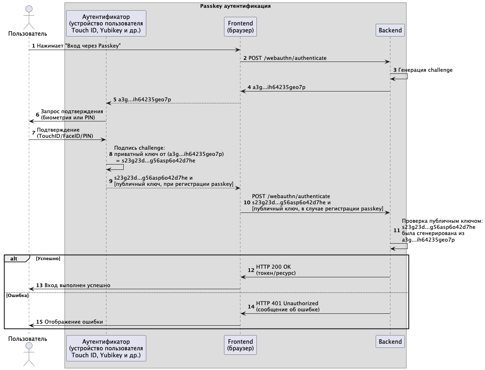

# 🔐 Passkey Authentication (WebAuthn) – Spring Security

Микросервис реализует беспарольную аутентификацию с использованием Passkey (WebAuthn API) на базе Spring Boot и Spring Security.

Разработка выполнена в рамках выпускной квалификационной работы:

> **Анализ современных методов аутентификации: устойчивость к угрозам информационной безопасности и перспективы развития беспарольных технологий**  
> НИУ ВШЭ, направление "Информационная безопасность", Федосов М.И., 2025

---

## 📌 Описание

Passkey — современная форма беспарольной аутентификации, основанная на WebAuthn и FIDO2. Использует асимметричную криптографию и биометрические методы для подтверждения личности без ввода пароля. Ключевые преимущества: устойчивость к фишингу, отсутствие паролей, поддержка синхронизации между устройствами.



Микросервис:

- Реализует регистрацию и вход с помощью Passkey/WebAuthn.
- Работает с публичными ключами, хранимыми на клиентском устройстве.
- Поддерживает браузеры с WebAuthn API (например, Chrome, Safari, Firefox).
- Сохраняет открытые ключи в in-memory хранилище (для демонстрации).
- Реализует конечные точки:
  - `/webauthn/registe` — Страница регистрации Passkey
  - `/login` — Страница входа с помощью Passkey
  - `/hello` — Защищённая конечная точка, доступна после аутентификации

---

## 🧩 Технологии

- Java 21
- Spring Boot 3
- Spring Security
- WebAuthn (библиотека `webauthn4j-core`)
- Maven

---

## ⚙️ Запуск проекта

```bash
git clone https://github.com/m-fedosov/authentication_passkey.git
cd authentication_passkey
./mvnw spring-boot:run
```